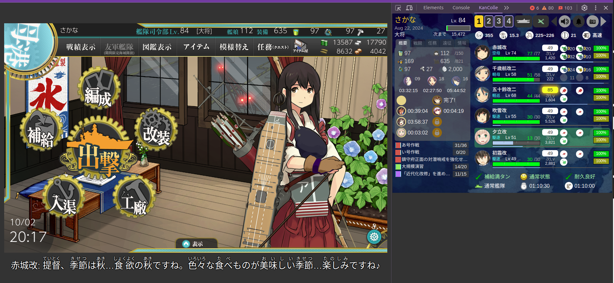

### Create Virtual Environment
```sh
# Make sure installed!!
sudo apt install python3-full

# Create a virtenv
python3 -m venv .venv
```

### Enter Virtual Environment Mode
```sh
. .venv/bin/activate
```

### Install Dependency
```sh
pip3 install -r requirements.txt
```

### Copy the `jp/quotes.json` to here

### And Run!
```sh
python3 main.py
# It'll generate a 'translated.json' file.
```

### Preview
